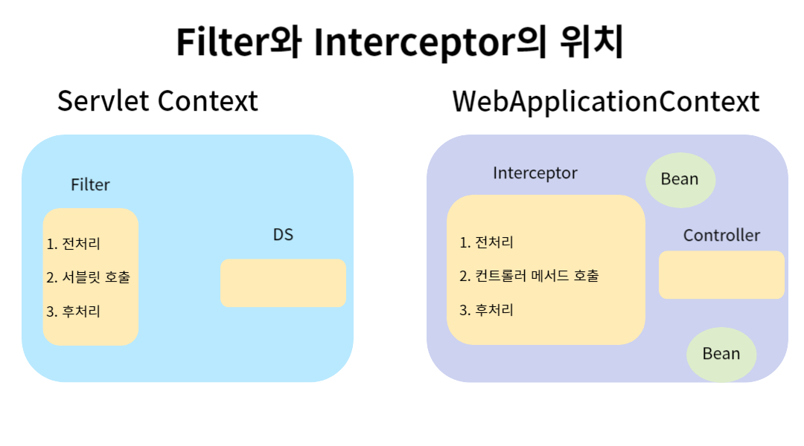

# Filter와 Interceptor

### 1. Filter
> 공통적인 요청 전처리와 응답 후처리에 사용. 로깅, 인코딩 등  
> 서블릿 앞에 Filter  
> 두개 이상의 필터를 사용하기도 함

### 2. Interceptor
> 필터의 관심사분리를 개선  
> Filter와 유사한 기능.  
> Filter(Servlet Context)와 달리 WebApplicationContext(Spring 컨테이너)내에 위치. 빈 주입 가능
> 같은 저장소에 있기 때문에 자바 빈 객체 사용 가능

> 스프링에서 발전
>> 서블릿 -> 컨트롤러  
>> 필터 -> 인터셉터