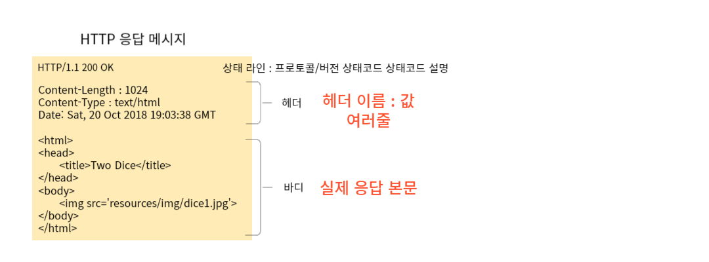

# HTTP 요청과 응답

### 1. 프로토콜(protocol)이란?
>   서로 간의 통신을 위한 약속, 규칙  
>   주고 받을 데이터에 대한 형식을 정의한 것

### 2. HTTP(Hyper Text Transfer Protocol)
>   단순하고 읽기 쉽다. - 텍스트 기반의 프로토콜  
>   상태를 유지하지 않는다.(stateless) - 클라이언트 정보를 저장X  
>   쿠키 : 클라이언트 식별 기술  
> 
>   확장 가능하다. - 커스텀 헤더(header) 추가 가능

### 3. HTTP 메시지 - 응답 메시지
> 

### 4. HTTP 메시지 - 요청 메시지
> GET : 전송 데이터를 URL에 붙임  
> POST : 바디에 데이터가 있음

### 5. HTTP 메서드 - GET, POST, HEAD, DELETE, PUT ...
| GET                                                                                                                                 | POST                                                                                                                                     |
|-------------------------------------------------------------------------------------------------------------------------------------|------------------------------------------------------------------------------------------------------------------------------------------|
| - 서버의 리소스를 가져오기 위해 설계 - QUERY STRING을 통해 데이터를 전달(소용량) - URL에 데이터 노출 되므로 보안에 취약 - 데이터 공유에 유리   ex. 검색엔진에서 검색단어 전송에 이용 | - 서버에 데이터를 올리기 위해 설계됨 - 전송 데이터 크기의 제한이 없음(대용량) - 데이터를 요청 메시지의 body에 담아 전송 - 보안에 유리, 데이터 공유에는 불리   ex. 게시판에 글쓰기, 로그인, 회원가입 |

### 6. 텍스트 파일과 바이너리 파일
> 바이너리 파일 : 문자와 숫자가 저장되어 있는 파일, 데이터를 있는 그대로 읽고 쓴다.  
> 텍스트 파일 : 문자만 있는 저장되어 있는 파일(메모장으로 열어보았을 때 읽기 쉬움), 숫자를 문자로 변환 후 쓴다.

### 7. MIME(Multipurpose Internet Mail Extensions) - email
> 텍스트 기반 프로토콜에 바이너리 데이터 전송하기 위해 고안  
> HTTP의 Content-Type헤더에 사용. 데이터의 타입을 명시 (브라우저가 올바르게 해석 하도록 함)

|타입| 설명               | MIME타입 예시(타입/서브타입)                               |
|---|------------------|--------------------------------------------------|
|text| 텍스트를 포함하는 모든 문서  | text/plain, text/html, text/css, text/javascript |
|image| 모든 종류의 이미지       | image/bmp, image/webp|
|audio| 모든 종류의 오디오 파일    | audio/midi, audio/mpeg, audio/webm, audio/ogg, audio/wav|
|video| 모든 종류의 비디오 파일| video/webm, video/ogg|
|application|모든 종류의 이진 데이터|application/octetstream, application/pkcs12, application/vnd.mspowerpoint, application/xhtml+xml, application/xml, application/pdf|
