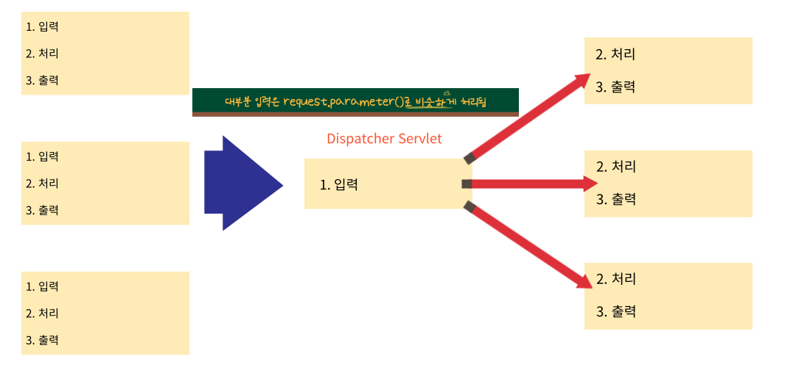

# 관심사의 분리, MVC 패턴 - 이론

### 1. 관심사의 분리 Separation of Concerns (SoC)
>- 하나의 메서드는 하나의 관심사만
>- 코드의 분리
>  - 관심사
>  - 변하는 것과 변하지 않는 것
>  - 중복코드 제거 - 메서드

### 2. 객체지향 설계 5대 원칙 - SOLID
>1. 단일 책임 원칙(SRP, Single Responsibility Principle) - **하나의 메서드는 하나의 일만**
>2. 개방 폐쇄 원칙(OCP, Open-closed Principle) - **상속Open**, **변경Closed** / 기존코드는 변경하지 말고 상속을 통해 변경
>3. 리스코프 치환 원칙(LSP, Liskov Substitution Principle) - **다형성** 
>4. 인터페이스 분리 원칙(ISP, Interface Segregation Principle) - **유사한 interface라도 목적이 다르면 분리**
>5. 의존관계 역전 원칙(DIP, Dependency Inversion Principle) - **추상화 의존한 코드 작성** / 구체적인 코드는 변경에 불리

### 3. 공통 코드의 분리 - 입력의 분리

> request.parameter()로 받던 데이터를 매개변수에서 받을 수 있다.
> ```java
> @RequestMapping("/getYoil")
> public void main(String year, String month, String day,
>   HttpServletResponse response) throws IOException {
>   
>   int yyyy = Integer.parseInt(year);
>   int mm = Integer.parseInt(month);
>   int dd = Integer.parseInt(day);
> }
>```
> 스프링이 값들을 찾아서 넣어줌  
> ReflectionAPI - 메서드에 대한 정보를 다 얻어올 수 있음  
> 메서드의 매개변수 이름을 보고 값을 읽을 수 있음  
> 요청에서 넘어온 이름과 일치해야 함
> 
> URL에서 넘어온 queryString의 값 중 숫자는 int로 자동변환 해 줌
>```java
> @RequestMapping("/getYoil")
> public void main(int year, int month, int day,
>   HttpServletResponse response) throws IOException {
>   
>   Calendar cal = Calendar.getInstance();
>   cal.set(year, month - 1, day);
>   
>   ...
> } 
>```

### 4. 출력(view)의 분리 - 변하는 것과 변하지 않는 것의 분리
> 메서드 내에서 작업한 결과 객체를 출력에 전달해주어야 함  
> 이 전달 객체를 Model 객체라 함

### 5. MVC 패턴
> 전체적인 흐름을 제어하는 처리 부분이 Controller   
> 작업한 결과를 담는 전달객체 Model  
> Model에 담겨있는 실행 결과를 보여주는 것 View 

> - Spring MVC
>   - 모든 요청을 다 받음 
>   - DispatcherServlet
>     - 입력 & 변환
>     - 모델 생성 - view에 전달할 data를 담을 객체
>   - Controller
>   - DispatcherServlet
>   - view
>   - 응답

### 6. ModelAndView
> Model과 View를 함께 생성 후 반환  
> 컨트롤러에서 Model을 생성하는 경우와 DS에서 생성 후 매개변수로 받는 경우의 차이가 있음  

### 7. 컨트롤러 메서드의 반환타입
> - String : 뷰 이름을 반환
> - void : 맵핑된 url의 끝단어가 뷰 이름
> - ModelAndView : Model과 뷰 이름을 반환 - 컨트롤러에서 Model을 생성하는 경우 반환