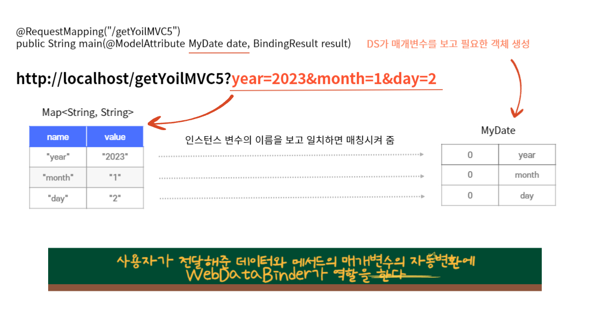

# @RequestParam과 @ModelAttribute

### 1. WebDataBinder

### 2. @ModelAttribute
> 적용 대상을 Model의 속성으로 자동 추가해주는 애너테이션  
> 반환 타입 또는 컨트롤러 메서드의 매개변수에 적용 가능
>> - 컨트롤러 메서드 매개변수
>>   - 기본형 : @RequestParam 생략가능
>>     - 생략 시 required=true로 기본 세팅되어 데이터가 넘어오지 않으면 Bad Request 에러가 남
>>   - 참조형 : @ModelAttribute 생략가능
>>     - 생략 시 타입의 첫글자를 소문자로 변경해 키값으로 사용 가능
>> 
>> 참조형 매개변수의 경우 @ModelAttribute를 생략해도 Model에 자동으로 추가 됨

### 3. @RequestParam
> 요청의 파라미터를 연결할 매개변수에 붙이는 애너테이션  
> 매개변수를 int 타입으로 받는 경우 defaultValue를 설정해주는 것이 좋음