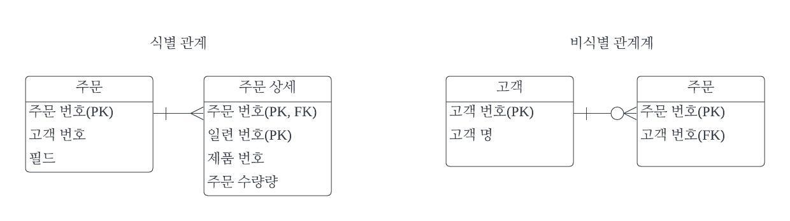
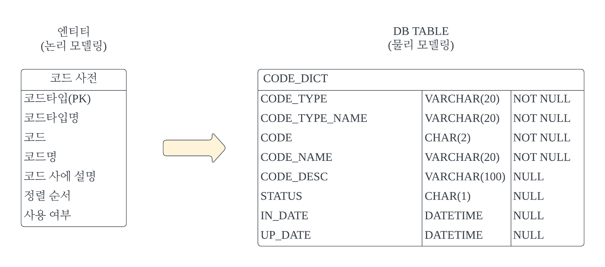

# 데이터 모델링이란?

### 1. 데이터 모델링 용어
> 모델링 : 실제 대상을 추상화하여 단순하게 표현하는 것  
> 데이터 모델링 : 실제 업무에 맞게 데이터의 특성과 구조를 만드는 것  
> ER모델 : 개체(Entity)와 개체간의 관계(Relationship)로 표현하는 모델
> ERD : ER모델을 그림(Diagram)으로 표현한 것

### 2. 기본 키(PK)와 참조 키(FK)
> 기본 키(Primary Key) : 테이블 내의 한 행을 식별해주는 컬럼  
> 참조 키(Foreign Key) : 다른 테이블에서 참조하는 컬럼(다른 테이블 pk)

### 3. ER모델의 구성 요소
> 엔티티(Entity) : 실존하는 개체 또는 개념(ex. 고객, 제품, 주문). 테이블  
> 관계(Relationship) : 엔티티 간의 규칙과 관계를 표현
> 속성(Attribute) : 데이터를 표현하는 최소 단위. 테이블의 컬럼(columm)
> 식별자(Identifier) : 엔티티(table)에서 인스턴스(row)를 구별할 수 있는 속성. 기본 키

### 4. 엔티티 관계(Entity Relationship)의 종류(1)
> 관계수(cardinality) : 두 엔티티 간의 대응되는 행의 개수  
> 1:1,   
> 1:n,   
> m:n(데이터 중복 발생)의 경우 교차테이블을 중간에 넣어 관계를 나눠주어야 함
> 
> 선택성(optionality) : 관련 행(row)의 존재가 필수(I) 또는 선택(O) 여부  
> 식별자 상속: 한 엔티티의 식별자(PK)가   
> 다른 엔티티의 PK가 되는 경우 -> 식별관계  
> 다른 엔티티의 PK가 되지 않는 경우 -> 비식별 관계
> 

### 5. 데이터 모델링의 절차
> 현재 시스템 기준 타 사이트 벤치마킹 - ERD, 업무 메뉴얼
> 인덱스 : 검색을 빠르게  
> 정렬 : 위치 정보 제공  
> 파티셔닝 : 테이블 나누기  
>> 성능을 위한 것
> 
> 데이터 표준, 용어 사전 만들어 두기
> 표준 단어, 표준 용어, 표준 도메인, 표준 코드  
> [핵심 데이터 모델링 p.70]

# 데이터 모델링 하는 방법

### 1. 분석 - 벤치마킹
> 주제 선정은 가능하면 일반적인 것으로 선택해야 구현이 쉬움  
> 기존 사이트를 2~3곳 선정하여 가입 & 사용  
> cafe24 쇼핑몰, 네이버 스토어에 쇼핑몰을 직접 만들고 운영  
> 구현 범위를 결정하고, 해당 화면을 캡쳐해서 화면 정의서 작성

### 2. 설계 - 개념 모델링
> 주제 영역 정의 : 데이터 모델링의 대상과 범위를 정의.  
> 핵심 엔티티 정의 : 업무 주체, 대상, 자원, 장소에 해당하는 엔티티 추출

### 3. 설계 - 논리 모델링
> 엔티티 정의 : 행위, 주체, 대상, 장소(5W1H)  
> 관계 정의 : 관계수, 선택성, 식별자 상속  
> 속성 정의 : 이름, 특성, 특징, 위치, 상태, 수량, 금액, 날짜, 시간, 사용여부

### 4. 설계 - 물리 모델링
> - 엔티티를 테이블로 변환
> 
> - 속성을 컬럼으로 변환. 시스템 컬럼 추가
> - 무결성 설계 : PK, FK, Not Null, Unique, Check, default value  
> - 성능 향상 
>   - 역정규화(정규화 - 테이블 쪼개기(성능이슈) -> 중복 제거)중복 컬럼 추가
>   - 인덱스 추가(소량검색)
>   - 파티셔닝(큰 테이블 분할)
> - 각 테이블의 컬럼에 데이터를 넣어보면 실수를 확인하기 쉽다.

### 5. 분류 테이블
> 대중소와 같이 고정적으로 분류하거나 상위와 하위와 같이 동적으로 분류  
> 계층의 수가 일정한 경우 고정적으로 분류. 분류ID가 상위 분류의 ID를 포함

### 6. 코드 테이블
> 여러 종류의 코드 목록을 하나의 테이블로 관리