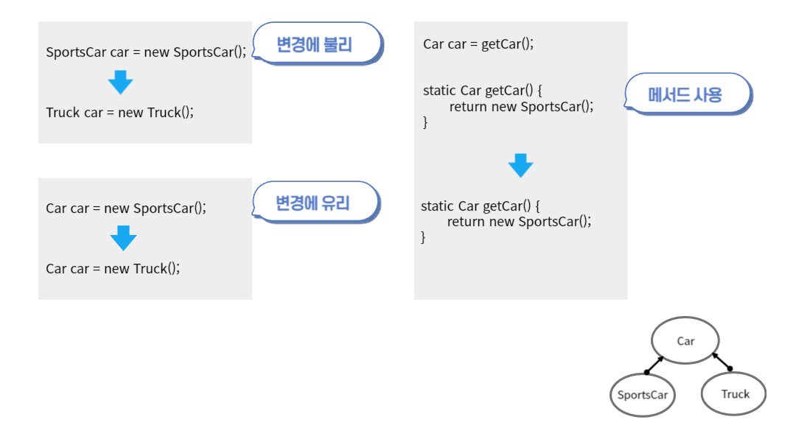
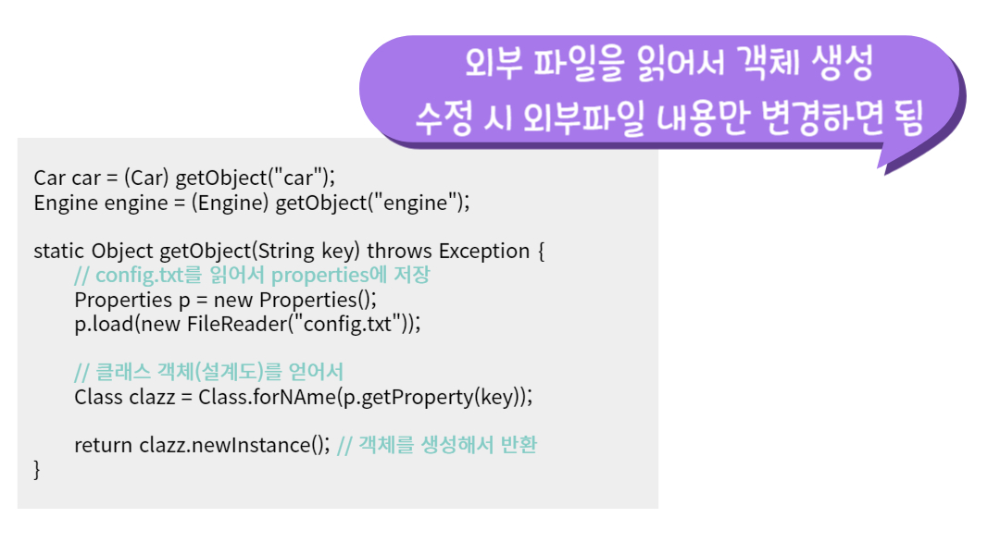
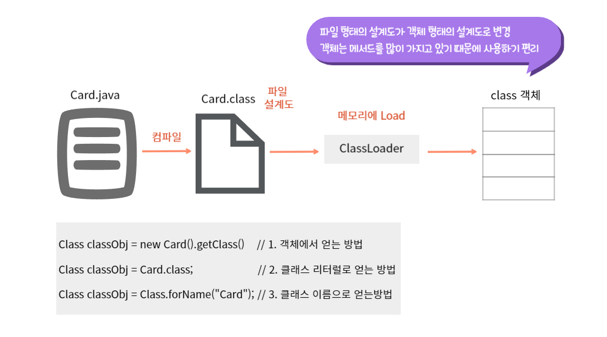

# Spring DI의 원리

### 1. 변경에 유리한 코드(1) - 다형성, 추상화, factory method
>
> 구체적인 코드는 변경에 불리  
> 메서드를 사용해 사용하는 곳은 변경하지 않고, 제공하는 쪽에서만 수정하도록 하는 것이 좋음

### 1_2. 변경에 유리한 코드(2) - Map과 외부 파일
> 

### 2. Reflection API란?
> 클래스의 정보를 얻을 수 있는 기능을 제공. java.lang.reflect패키지  
> 실행 중에 객체 생성, 메서드 호출 등을 가증하게 한다.   
> 동적 : 실행중에 결정, 유연하게 처리할 수 있다.  / (정적 : 컴파일러 결정)

### 3. Class 객체
> Class클래스의 객체. 클래스당 1개만 존재(싱글톤)  
> 해당 클래스의 정보 조회, 객체 생성 등의 기능 제공  
> 설계도가 객체로 존재 (멤버 변수가 몇개고, 애너테이션이 몇개 붙어있고, 메서드가 뭐가 있고.. 등등)
> 클래스 파일(*.class)이 메모리에 로드될 때 생성
> 

### 4. 객체 컨테이너(ApplicationContext)
> - 객체 저장소
> - 객체 찾기
>   - by Name : 이름으로 찾기(key)
>   - by Type : 타입으로 찾기(class 타입, value instanceof)

### 5. 객체를 자동 연결 하기 
> - @Autowired : byType 클래스 타입
>   - spring container에서 타입으로 빈을 검색해서 참조 변수에 자동 주입(DI)
>   - 검색된 빈이 n개이면, 그 중에 참조변수와 이름이 일치하는 것을 주입.
>   - 주입 대상이 변수일 때, 검색된 빈이 1개 아니면 예외 발생
>   - 주입 대상이 배열 일 때, 검색된 빈이 n개라도 예외 발생X
>   - @Autowired(required=false)일 때, 주입할 빈을 못찾아도 예외 발생X
> - @Resource : byName 참조변수 이름
>   - spring container에서 이름으로 빈을 검색해서 참조 변수에 자동 주입(DI)
>   - 일치하는 이름의 빈이 없으면, 예외 발생

