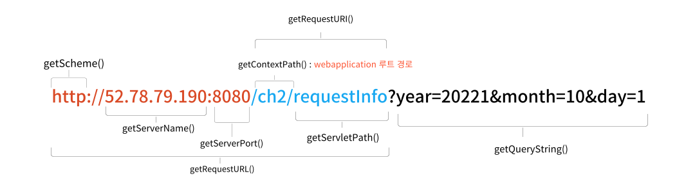

# 원격프로그램에 데이터 전달하기

### 1. HttpServletRequest 클래스 - HTTP 요청 정보를 제공
> 클라이언트가 요청을 보내면  
> 톰캣이 요청정보를 받아서 HttpServletRequest 객체를 만들고  
> 객체에 요청정보를 담아서 매개변수로 넘겨 줌 ( 메서드 작성 시 필요한 정보 )

### 2. HttpServletRequest의 메서드
> 
> queryString : 원격프로그램에 data 전달  
> & 기준으로 name = value 한쌍으로 값 전달  
> 쿼리스트링으로 넘어온 data 읽는 메서드
> ``` java
> String year = request.getParameter("year");
> String month = request.getParameter("month");
> String day = request.getParameter("day");  
> 
> Enumeration enum = request.getParameterNames();
> Map paramMap = request.getParameterMap();
> 
> String[] yearArr = request.getParameterValues("year");
> ```

### 3. HTTP 요청방법 - GET, POST
>- URL 직접 입력  
>- form 태그 사용  
>- HTTP METHOD() : 요청방법  
>  - GET : 읽기  
>  - POST : 쓰기