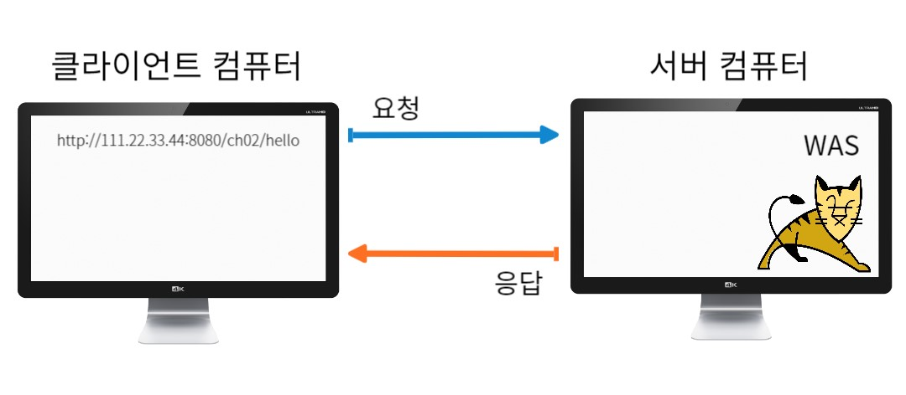

# 클라이언트와 서버
### 1. 클라이언트와 서버

>클라이언트(client) : 서비스를 요청하는 애플리케이션  
>서버(server) : 서비스를 제공하는 애플리케이션  

### 2. 서버의 종류 - 어떤 서비스를 제공?
> Email server  
> File server  
> Web server : 브라우저를 통해 사용하는 서비스(텍스트, 이미지, 오디오, 비디오 등)

### 3. 서버의 포트
> 하나의 ip에 다양한 서비스가 서버프로그램이 존재 할 때  
> 다른 포트로 연결 되어있어야 함  
> 111.22.33.44:25 -> Email server  
> 111.22.33.44:22 -> File server  
> 111.22.33.44:80 -> Web server

### 4. 웹 애플리케이션 서버(WAS)란?
> Application(프로그램)  
> 클라이언트가 서버에 있는 프로그램을 사용할 수 있도록 해 줌  
> 원격 프로그램 호출 가능한 이유가 톰캣이라는 WAS가 서버에 설치되고 실행되고 있기 때문  
>        * spring boot에서는 톰캣 프로그램을 내장된 형태로 사용

### 5. HTTP요청부터 응답까지의 과정
> 1. DNS 서버에 문의 
>   : 도메인 이름의 ip주소가 무엇인지 알려줌  
> 2. TCP 연결(3-way handshake)  
>   : 클라이언트가 연결을 원한다고 요청(SYN) -> 서버가 응답(ACK)  
>   : 클라이언트와 서버간의 통신 할 수 있는 연결이 만들어 짐(I/O 스트림)  
>   : 클라이언트가 출력을 하면 웹서버에 입력으로 들어 감  
>   : 이번에는 웹서버가 클라이언트한테 연결하자 요청(SYN) -> 클라이언트 알았다 응답(ACK)  
>   : 웹서버와 클라이언트가 통신 할 수 있는 연결이 하나 더 만들어 짐(I/O 스트림)  
>   : 요청에 대한 응답을 웹서버도 출력을 해서 클라이언트가 입력을 받게 됨  
>   : 요청과 응답이 네번 왔다갔다.  
>   : 중간에 웹서버의 ACK와 SYN을 합쳐서 총 세번 3-way handshake가 됨  
> 3. 연결 후 HTTP 요청  
> 4. HTTP 응답  
> 5. 응답을 수신하고 연결을 종료 (기본적으로 요청과 응답이 끝나면 연결을 종료/재사용하는 방법도 있음)

### 6. IP, TCP, HTTP
> IP(Internet Protocol) : IP주소를 이용한 전송 프로토콜. 비연결 기반  
> TCP(Transfer Control Protocol) : 패킷 전송을 제어. 연결 기반  
> HTTP(Hyper Text Transfer Protocol) : 텍스트 프로토콜
